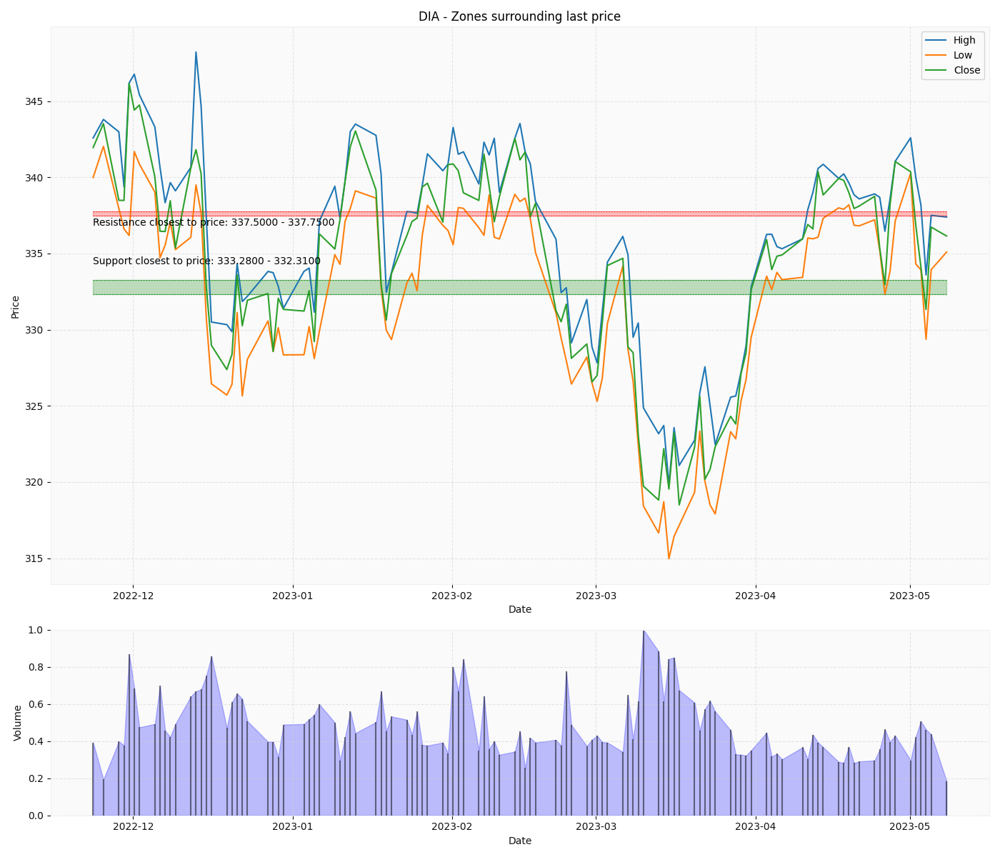
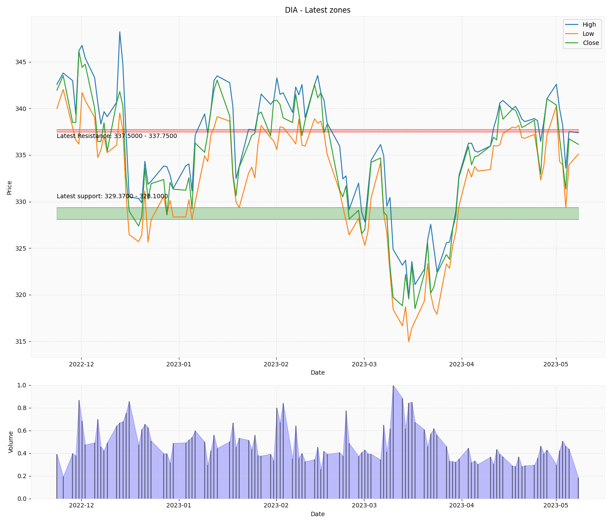
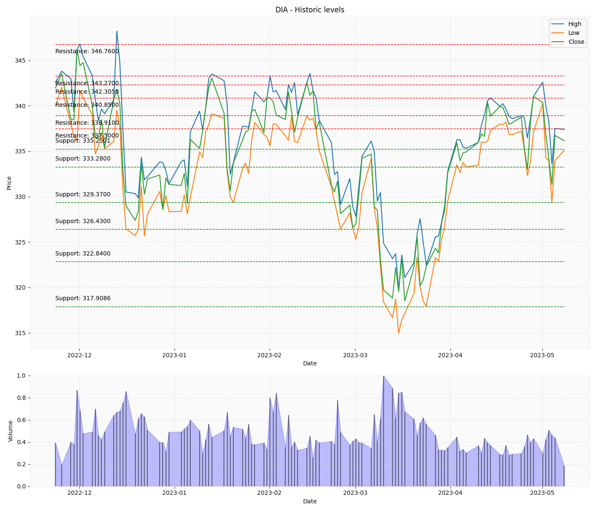

# KMeansSupportResistancePython

Create Support/resistance zones and levels from a Pandas DataFrame with the columns Date, High, Low, Close and Volume.

There are three modes, suitable for different trading scenarios:

- Generate latest detected S/R zones
- Generate S/R zones surrounding the latest price
- Generate historic S/R levels surrounding the latest price

Requirements:

- Python 3
- numpy
- scipy.signal
- sklearn.metrics
- sklearn.cluster
- matplotlib.pyplot


Usage:

```
from supres2 import plot_supres

...

# Generate All Historic S/R levels
plot_supres(df=df, title=ticker, filename=f"{ticker}.png",show_all=True)

# Generate Latest Detected S/R zones
plot_supres(df=df, title=ticker, filename=f"{ticker}.png",show_latest=True,show_closest=False)

# Generate S/R zones surrounding the current price
plot_supres(df=df, title=ticker, filename=f"{ticker}.png",show_latest=False,show_closest=True)
```

Please see the images for sample outputs from all modes.










This repository is inspired by https://github.com/JOravetz/stock_support_resistance_analysis

